7-Zip is an open-source file archiver. By default, it creates archives in the 7z format. However, it also supports other archive formats (such as zip, cab, rar, tar, tar.gz, gzip...). 7-Zip does not have an automatic update mechanism. Therefore, users need to check for updates regularly and keep the program up to date.

**CVE-2025-0411** is a recently discovered vulnerability that allows bypassing Windows' **Mark-of-the-Web (MoTW)** security mechanism. This vulnerability requires user interaction and occurs while processing archived files.

**Mark-of-the-Web (MoTW)** is a metadata tag indicating that a file comes from the internet and might be potentially dangerous. _Windows Defender SmartScreen_ applies additional security checks to files having this tag.

When a file is downloaded from a browser or an email attachment, an **NTFS Alternate Data Stream (ADS)** is added to its local copy with the name **Zone.Identifier**. If the **ZoneId** value in this data stream is **“3”**, it means the file came from the internet, and this value is also passed to every file extracted from the archive.

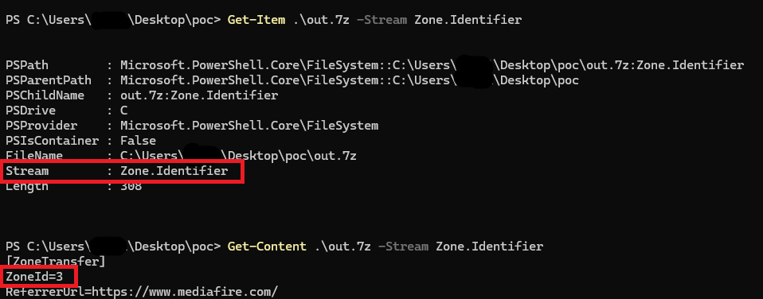

The _Mark-of-the-Web (MotW)_ feature was added in 7-Zip version 22.0. However, it is not enabled by default. To enable this feature, you need to activate it through the 7-Zip interface or by editing the Windows registry.

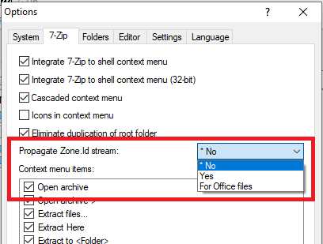

**CVE-2025-0411** occurs in 7-Zip versions prior to 24.09 due to the failure to apply the MotW mark to inner files in double-encapsulated archives. This lets malicious files spread without being noticed and allows malicious code to run on Windows systems.

# Threat Actors

The **CVE-2025-0411** vulnerability is being used in cyberattacks during the Russia-Ukraine war. It is actively used in cyberattacks campaigns targeting government institutions and private sector organizations in Ukraine.

Attackers use this vulnerability to spread the **SmokeLoader** malware. _Spear phishing_ emails are used to gain initial access.

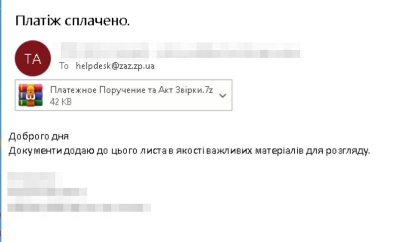

Attackers use the **homoglyph** method to show the inner archive file as a Microsoft Word Document. This reduces the probability of detection.

Characters that look similar to each other are called homoglyphs or homographs. Homoglyph attacks involve manipulating users by using visually similar characters. An example is the similarity between the Cyrillic 'а' (U+0430) and the Latin 'a' (U+0061).

In the attacks targeting Ukraine, the file inside the double-encapsulated archive has the extension **"doc"**. However, the "c" letter (U+0063) is the Cyrillic "с" (U+0441). Therefore, the file disguised as a _Microsoft Word_ document is an archive file.

The second archive file contains a **"URL"** file and does not have the MotW tag. This URL file points to a server hosting another archive file (invoce.zip).

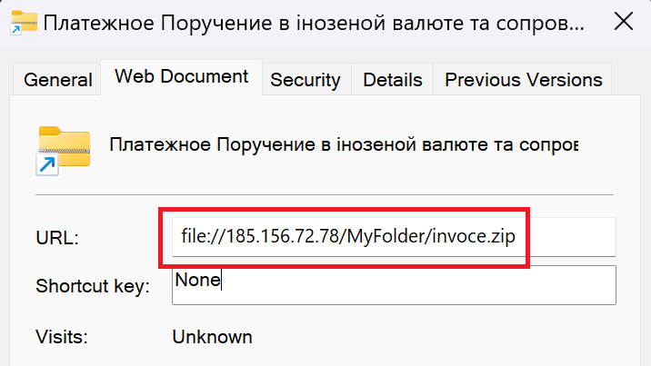

The archive file obtained from the server contains  **SmokeLoader** malware disguised as a PDF. When the user runs this file, the malicious activities are executed.

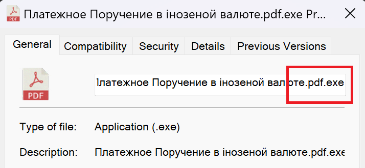

Thus, the CVE-2025-0411 vulnerability in 7-Zip is being exploited. It is believed that the legitimate email accounts used in these attacks are accounts that were exfiltrated.

# Proof of Concept – POC

A program named **shell.exe** has been created to run the calculator (calc.exe).

The created EXE (shell.exe) file requires double compression. The inner archive is named **in.doс**, and the outer archive is named **out.7z**. The "c" letter in the extension of the **in.doс** has been replaced with the Cyrillic "с" character using the homoglyph technique. The hierarchy is as follows:

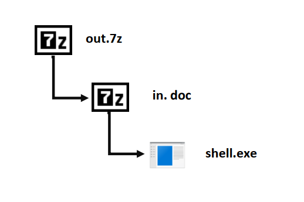

The **out.7z** archive is marked with a MotW (Mark-of-the-Web) mark, indicating that it is an internet-sourced file. In the archive’s Properties section, the Security part shows that this file has the MotW mark.

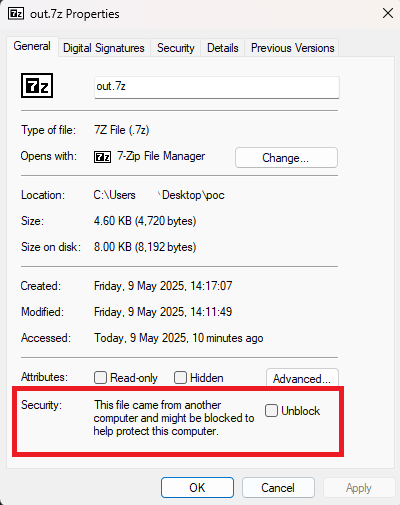

The MotW mark can also be checked using _PowerShell_. If the **ZoneId** value is **“3”**, it indicates that the file is internet-sourced. Afterward, the victim extracts the files from the archive and runs the malicious file.

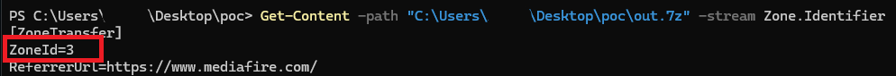

When this process is tried in the vulnerable version, the MotW mark is not transferred to the files inside the archive. The **in.doс** archive file is disguised as a **DOC** file and does not have the MotW mark.

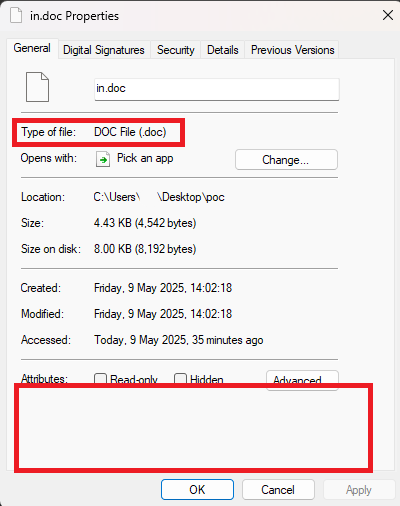

Similarly, the **Shell.exe** file does not have the MotW mark and runs without triggering any security mechanisms.

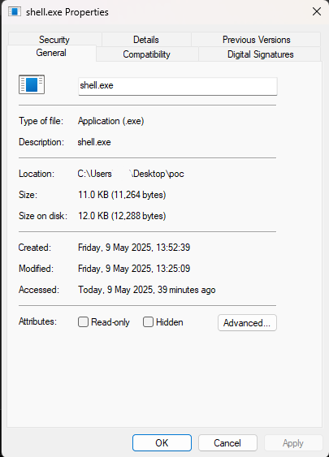

However, when tested in the version where the vulnerability is fixed, it is observed that the MotW tag is transferred to the files inside. When trying to run the **Shell.exe** file, it is blocked by _Microsoft_ _Defender_ _SmartScreen_.

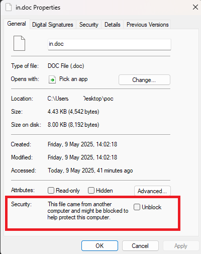

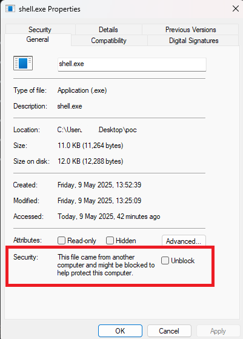

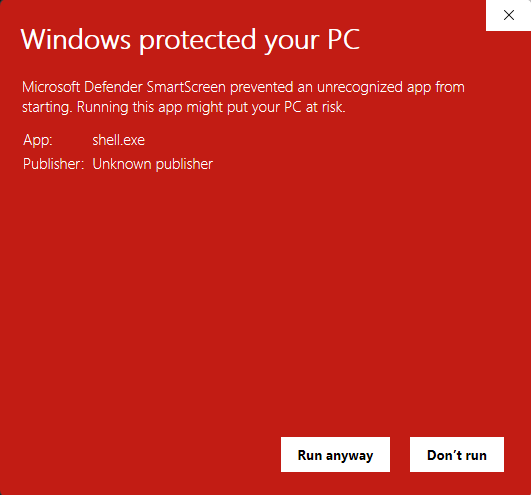

# Conclusion

**CVE-2025-0411** is a security vulnerability in 7-Zip software where the Mark-of-the-Web (MoTW) mark is not transferred to files inside archives during the extraction process. This issue allows attackers to conceal malicious content using a multi-layered archiving method, bypassing security controls.

The vulnerability can be easily exploited, especially through email attachments, when combined with social engineering techniques. Therefore, it is critically important to implement preventive security measures at both the user and system levels.

The primary step to guard against this vulnerability is to check if the 7-Zip version used is up to date. Caution should be taken against phishing attacks. Attackers try to trick the user by sending malicious attachments from email addresses that seem to be trusted. Therefore, emails from unknown senders should be carefully examined; the content must be verified before opening the attachments. Email filtering systems and advanced *spam* protections are an effective first defense at this point.

In particular, the contents of compressed files such as ".zip" or ".7z" should be analyzed before execution and, if necessary tested in virtual machine environments.

Proactive measures should also be taken against homograph attacks. In such attacks, fake domain names are created using visually similar characters. In corporate networks, these attacks should be detected and prevented through DNS-based domain name monitoring, URL filtering, and threat intelligence integration. Additionally, users should receive awareness training regarding such domain names.

In addition, it should be regularly tested whether the operating system correctly processes Mark-of-the-Web (MoTW) labels.  Security software that performs behavior-based analysis and sandbox solutions should also be utilized to detect malicious content.

Finally, for early detection of security incidents, log management and threat hunting activities should be conducted regularly, and systems should be monitored using SIEM (Security Information and Event Management) platforms.